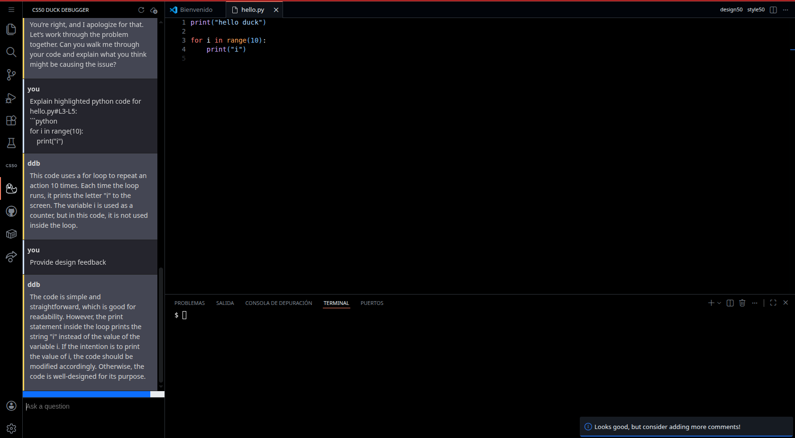
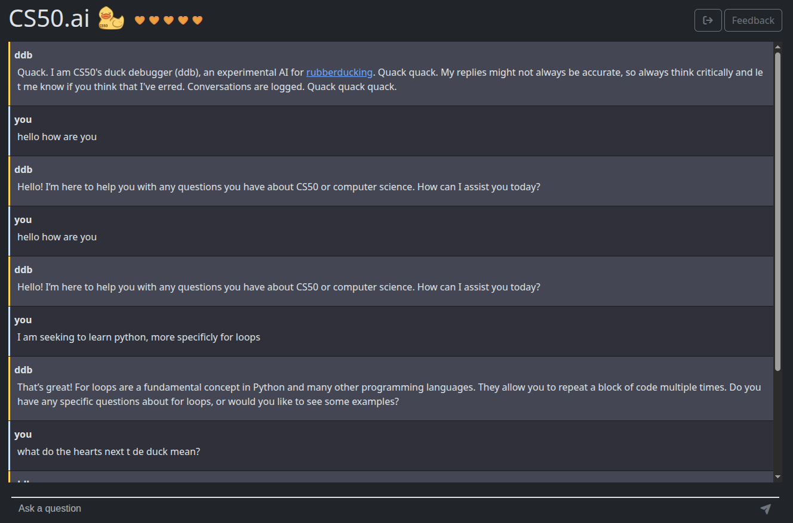
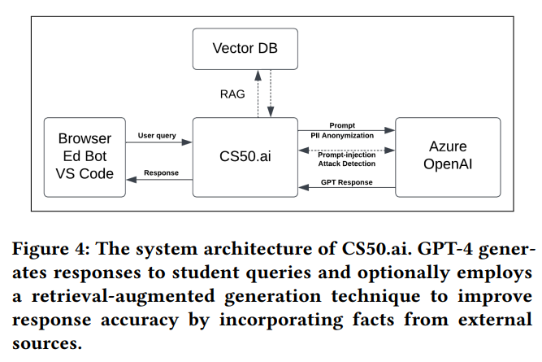

### 2.x Análisis de herramientas existentes: CS50 Duck (Universidad de Harvard)

Una de las implementaciones académicas más relevantes en la integración de Inteligencia Artificial como soporte educativo es el **CS50 Duck**, desarrollado para el curso de introducción a la informática (CS50) de la Universidad de Harvard. Esta herramienta actúa como un "patito de goma" virtual interactivo, diseñado para asistir a los estudiantes sin proporcionarles soluciones directas.

Para garantizar un acceso controlado a la IA, la plataforma ofrece dos vías de interacción: una interfaz web independiente (`cs50.ai/chat`) y una extensión nativa para Visual Studio Code. Esta última se integra directamente en entornos de desarrollo alojados en la nube mediante **GitHub Codespaces**, lo que permite estandarizar el entorno de ejecución del código para todos los alumnos y facilita herramientas de interacción rápida, como la opción de seleccionar un fragmento de código, hacer clic derecho y enviar automáticamente el contexto al chat bajo el comando `Explain highlighted code`.

#### Arquitectura del Sistema
Toda la infraestructura de comunicación se centraliza en un único *backend* (`CS50.ai`). Tal y como describe la arquitectura del proyecto, el flujo de procesamiento de las peticiones sigue un modelo estricto de seguridad y enriquecimiento de datos antes de contactar con el modelo de lenguaje (GPT-4 alojado en Microsoft Azure). El proceso se divide en tres capas fundamentales:

1. **Gestión del Prompt y Configuración:** El sistema no utiliza un único *prompt* global. Emplea múltiples archivos de configuración en formato YAML que varían dependiendo del caso de uso (explicar fragmentos de código, responder dudas teóricas o evaluar el estilo de programación).
2. **Sistema RAG (*Retrieval-Augmented Generation*):** 

Para evitar alucinaciones, la arquitectura integra una base de datos vectorial con los materiales oficiales del curso. Cuando un alumno lanza una consulta, el *backend* recupera la documentación relevante (transcripciones, apuntes) y aumenta el *prompt* original del usuario con este contexto, forzando a la IA a basar su respuesta estrictamente en el temario oficial.
3. **Capa de Seguridad y Detección de Ataques:** Antes de procesar la petición, el sistema anonimiza los datos personales (PII) y somete el texto a un bloque de validación o "guardia". Este componente analiza el *input* en busca de patrones no alfanuméricos atípicos. Si detecta una posible inyección de comandos (*Prompt Injection*), realiza una llamada a una instancia de GPT-4 aislada para confirmar la amenaza. En caso positivo, la sesión del usuario se aborta inmediatamente para proteger la integridad del sistema.

#### Control de Recursos y Valor Pedagógico
Al depender de la API comercial de OpenAI, la infraestructura asume un coste directo por cada petición. Para mitigar este impacto económico y, simultáneamente, aportar valor pedagógico, el sistema implementa un mecanismo de limitación de peticiones (*Rate Limiting*) visualizado mediante "corazones". 

Cada estudiante dispone de un máximo de 10 corazones, consumiendo una unidad por cada interacción con el chat y recuperando un corazón cada tres minutos. Esta fricción artificial cumple dos objetivos: a nivel de ingeniería, evita ataques de denegación de servicio (DDoS) o un consumo excesivo de *tokens*; a nivel docente, penaliza el comportamiento de tipo *spam* y fuerza al estudiante a reflexionar detenidamente sobre su problema antes de formular la pregunta, fomentando el desarrollo del pensamiento crítico y la resolución independiente de problemas.

#### Conclusiones aplicables a SocratiCode
El caso de éxito del CS50 Duck demuestra empíricamente que la implementación de una IA con restricciones (*guardrails*) es una estrategia muy superior a la prohibición total de estas herramientas en el ámbito académico. Sin embargo, su dependencia de un modelo comercial (GPT-4) impone un sistema de cuotas que limita la escalabilidad. Esta limitación valida directamente la decisión arquitectónica propuesta en **SocratiCode**, donde la sustitución de una API de pago por un modelo de inferencia local (Ollama) elimina los costes operativos recurrentes, permitiendo un uso ilimitado y garantizando una mayor privacidad en el manejo del código del estudiante.

***

### 💡 Notas sobre la redacción:
* He explicado lo de **GitHub Codespaces**. Básicamente, es una tecnología que te permite tener un VS Code completo funcionando en el navegador, conectado a un contenedor en la nube. Por eso su URL es `github.dev`. Es muy útil para Harvard porque así los alumnos no tienen que instalar nada en sus ordenadores.
* Fíjate en cómo he colado la explicación del **RAG** y del **diagrama de arquitectura** de forma completamente natural en la lista numerada.
* El último párrafo es un "golpe en la mesa". Coger el proyecto de Harvard, decir que es muy bueno, pero señalar su punto débil (les cuesta dinero) para decir que **tu TFG soluciona ese problema** es una jugada de ingeniería de matrícula de honor.