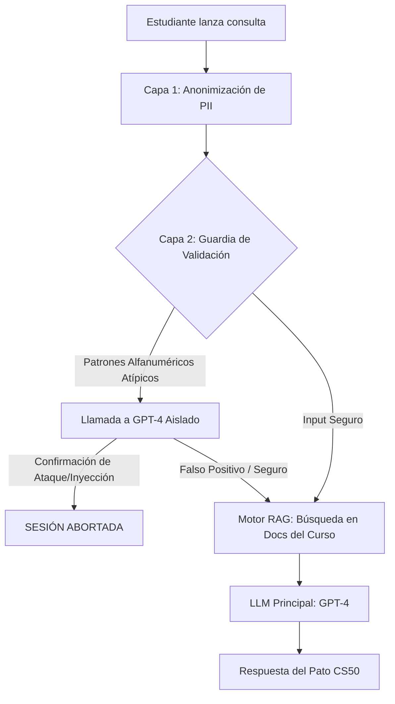
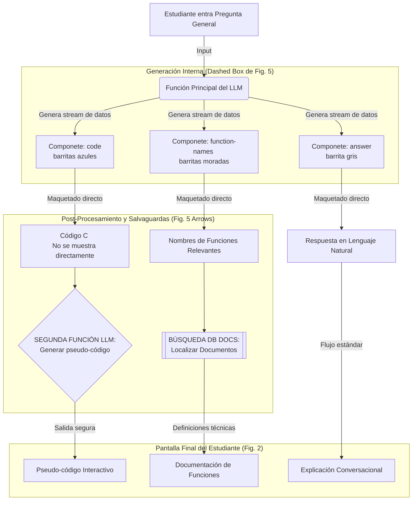

### 1. El Entorno: ¿Dónde vive la IA?
* **Harvard (CS50 Duck):** Su hábitat natural es **VS Code**. El objetivo es la **fricción cero**. Si un alumno está programando y no entiende algo, subraya el código, usa el atajo y el "pato" le explica. Es una herramienta de productividad académica.
* **CodeAid:** Es una **interfaz dedicada** (como viste en las Figuras 1 y 2). Obliga al alumno a salir un momento de su editor para interactuar con "botones de ayuda rápida". Es más como un panel de control donde eliges exactamente qué tipo de ayuda necesitas (¿quieres que te explique el código o que te ayude a arreglarlo?).

### 2. El "Cerebro": ¿De dónde viene la respuesta?
* **Harvard (RAG):** Su prioridad es la **Fidelidad**. Utiliza RAG para que la IA no diga nada que contradiga al profesor Malan. Si el profesor explicó los punteros de una forma específica en la semana 3, el RAG se asegura de que la IA use esa misma explicación.
* **CodeAid (Pipeline de Lógica):** Su prioridad es la **Pedagogía**. No le importa tanto "citar al profesor", sino asegurarse de que el alumno no haga trampas. Por eso hace el truco de magia que viste en la imagen: **Resuelve -> Traduce a Pseudo-código -> Entrega**.

### 3. La Interacción: ¿Cómo ayuda?
* **Harvard:** Es más conversacional y contextual. Se siente como un chat inteligente que conoce todo el curso de memoria.
* **CodeAid:** Es **funcional y estructurada**. Al tener botones como *"Help Fix Code"*, el sistema ya sabe qué "máscara" ponerse. Si pulsas ese botón, el sistema activa automáticamente el generador de pseudo-código para no darte la respuesta masticada.

---

### Resumen Visual de la Diferencia

| Característica | CS50 Duck (Harvard) | CodeAid (UBC) |
| :--- | :--- | :--- |
| **Ubicación** | Integrado en el editor (VS Code). | Interfaz web propia (Dashboard). |
| **Poder Especial** | **RAG:** "Sé lo que dijo el profe". | **Pseudo-code:** "Te explico la lógica, no el código". |
| **Interfaz** | Minimalista (Chat / Explain Highlighted). | Rica en botones (Ayuda rápida dirigida). |
| **Objetivo** | Que no te detengas por dudas teóricas. | Que no copies código sin entenderlo. |

---

## 1. Diagrama de CS50 Duck (Harvard)
Este sistema se basa principalmente en **RAG** (*Retrieval-Augmented Generation*). Su objetivo es que la IA "sepa" lo mismo que el profesor.

**Punto clave:** La inteligencia viene de la **información externa** (el contexto del curso) que se le inyecta a la IA.

---

## 2. Diagrama de CodeAid (UBC)
Este sistema se basa en **Prompt Engineering refinado** y **Privacidad activa**. Su objetivo es la precisión técnica sin revelar la solución y la protección de datos.

Este diagrama técnico es fascinante porque demuestra el complejo pipeline de datos que hay detrás de una simple respuesta de IA en educación:

1. **Generación Segmentada:** El LLM principal no genera un bloque de texto libre. Está entrenado (mediante few-shot prompting visto en la Fig. 3) para generar tres componentes técnicos separados y "maquetables" a la vez.
2. **La Salvaguarda del Pseudo-código:** El código C real (D2) es generado internamente por la IA para asegurar que la lógica sea correcta. Pero nunca llega a los ojos del alumno. En su lugar, es interceptado y enviado a un segundo proceso de IA que traduce ese código C en pseudo-código. Esto es lo que garantiza que el alumno entienda la lógica sin poder simplemente copiar y pegar.
3. **Sistema de Apoyo:** Además de la respuesta lógica, el sistema extrae automáticamente los nombres de las funciones clave utilizadas y busca su documentación oficial en la base de datos del curso.

---

### Diferencias principales resumidas
1.  **La Fuente:** Harvard usa una base de datos de documentos (RAG); CodeAid usa la lógica interna del modelo y "recetas" predefinidas (Few-shot).
2.  **La Privacidad:** CodeAid tiene un paso extra de **limpieza de datos (Scrubbing)** antes de que la información salga hacia la IA.
3.  **El Resultado:** Harvard te responde como un tutor que leyó el libro del curso; CodeAid te responde con **pseudo-código interactivo** que te obliga a pensar.