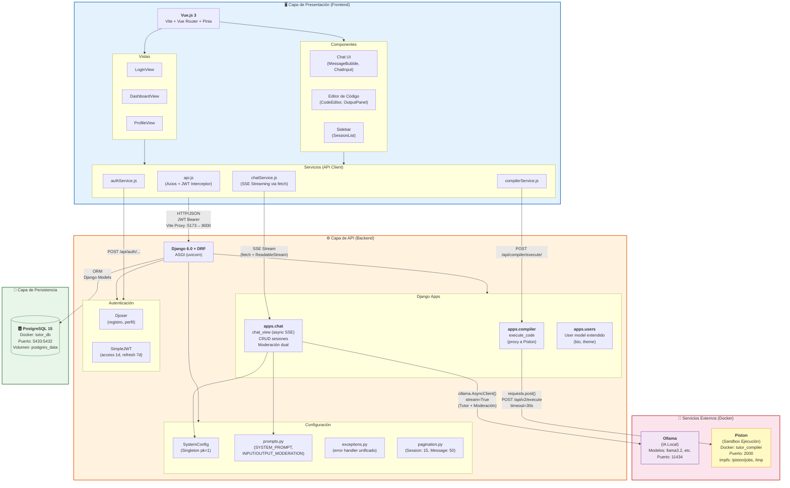

# Figura 3-5: Diagrama de Arquitectura — Separación en Capas

Arquitectura completa de SocratiCode mostrando la separación en capas y los servicios externos contenerizados.

## Descripción de las Capas

| Capa                  | Tecnología                         | Responsabilidad                                                                                                                   |
|-----------------------|------------------------------------|-----------------------------------------------------------------------------------------------------------------------------------|
| **Presentación**      | Vue.js 3 + Vite                    | Interfaz de usuario SPA. Gestión de estado con Pinia, enrutamiento con Vue Router, comunicación SSE con `fetch()` nativo y REST con Axios. |
| **API**               | Django 6.0 + DRF + ASGI (uvicorn)  | Lógica de negocio: endpoints REST, streaming asíncrono SSE, moderación dual (input síncrona + output async), autenticación JWT con Djoser. |
| **Persistencia**      | PostgreSQL 15 (Docker)             | Almacenamiento relacional de usuarios, sesiones, mensajes y configuración. Acceso exclusivo vía Django ORM.                        |
| **Servicios Externos**| Ollama + Piston (Docker)           | Ollama: inferencia LLM local (tutor socrático + moderación de contenido). Piston: ejecución aislada de código en sub-contenedores con almacenamiento efímero (tmpfs). |

## Flujo de Comunicación

| Origen → Destino              | Protocolo / Mecanismo                                                    |
|-------------------------------|--------------------------------------------------------------------------|
| Vue → Django                  | HTTP/JSON vía Vite proxy (`:5173` → `:8000`). JWT Bearer en headers.     |
| Vue → Django (chat)           | SSE vía `fetch()` + `ReadableStream`. Tokens enviados como `data: {...}`. |
| Django → PostgreSQL           | Django ORM (conexión configurada en `DATABASE_URL`).                      |
| Django → Ollama (tutor)       | `ollama.AsyncClient().chat(stream=True)` — streaming async token a token. |
| Django → Ollama (moderación)  | `ollama.chat(stream=False)` (input) / `ollama.AsyncClient().chat(stream=False)` (output). |
| Django → Piston               | `requests.post()` — HTTP/JSON síncrono a `PISTON_URL/api/v2/execute`.    |
