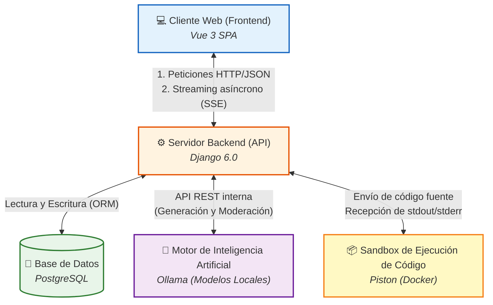

# Figura 3-6: Diagrama de Componentes del Sistema

Este diagrama ilustra a alto nivel los cinco componentes principales que conforman la arquitectura de SocratiCode y cómo interactúan entre sí, de una manera simplificada y directa.

## Descripción de los componentes:

1. **Cliente Web (Frontend)**: La interfaz con la que interactúa el alumno. Construida como una aplicación de página única (SPA) con Vue 3. Se encarga de capturar la entrada del usuario, mostrar la interfaz del chat y el editor de código, y renderizar en tiempo real el streaming de respuestas del tutor.
2. **Servidor Backend (API)**: El núcleo orquestador del sistema desarrollado en Django. Gestiona la lógica de negocio, la autenticación de usuarios, coordina el streaming Server-Sent Events (SSE) hacia el frontend y actúa como puente de comunicación (proxy) seguro con los servicios externos.
3. **Base de Datos**: Sistema de persistencia (PostgreSQL) donde se almacenan a largo plazo los usuarios, sus historiales de sesiones, los mensajes de chat enviados/recibidos y la configuración global del sistema.
4. **Motor de Inteligencia Artificial**: Servicio autónomo (Ollama) encargado de realizar la inferencia de los modelos de lenguaje (LLMs) localmente. Provee tanto el flujo conversacional del tutor socrático como las evaluaciones de moderación de contenido.
5. **Sandbox de Ejecución de Código**: Entorno aislado (Piston) que recibe código fuente en distintos lenguajes, lo compila o interpreta dentro de un sub-contenedor efímero, y devuelve los resultados (salida estándar o errores) de forma segura sin comprometer la máquina anfitriona.
