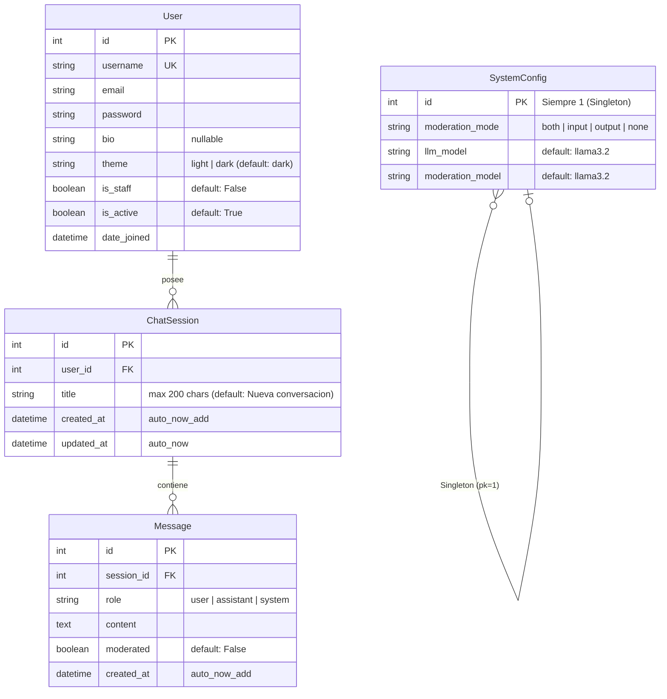

# Figura 3-4: Diagrama Entidad-Relación — Modelo de Datos

Modelo de datos de SocratiCode extraído de los modelos Django (`apps/chat/models.py`, `apps/users/models.py`).

## Notas sobre el modelo

| Entidad        | Particularidad                                                                                                                                         |
|----------------|--------------------------------------------------------------------------------------------------------------------------------------------------------|
| `User`         | Extiende `AbstractUser` de Django. Añade campos `bio` (TextField nullable) y `theme` (CharField con choices `light`/`dark`). Modelo intercambiable vía `AUTH_USER_MODEL = 'users.User'`. |
| `ChatSession`  | Relación `ForeignKey` a `User` con `on_delete=CASCADE` y `related_name='chat_sessions'`. El campo `updated_at` se actualiza manualmente en `_auto_name_and_touch()` para reflejar la actividad real. |
| `Message`      | Relación `ForeignKey` a `ChatSession` con `on_delete=CASCADE` y `related_name='messages'`. El campo `moderated` indica si el mensaje fue bloqueado por el sistema de moderación. |
| `SystemConfig` | Implementa el patrón Singleton: `save()` fuerza `pk=1`, `get()` usa `get_or_create(pk=1)`. No tiene relación con otras entidades; es una tabla de configuración global consultada en cada petición de chat. |
