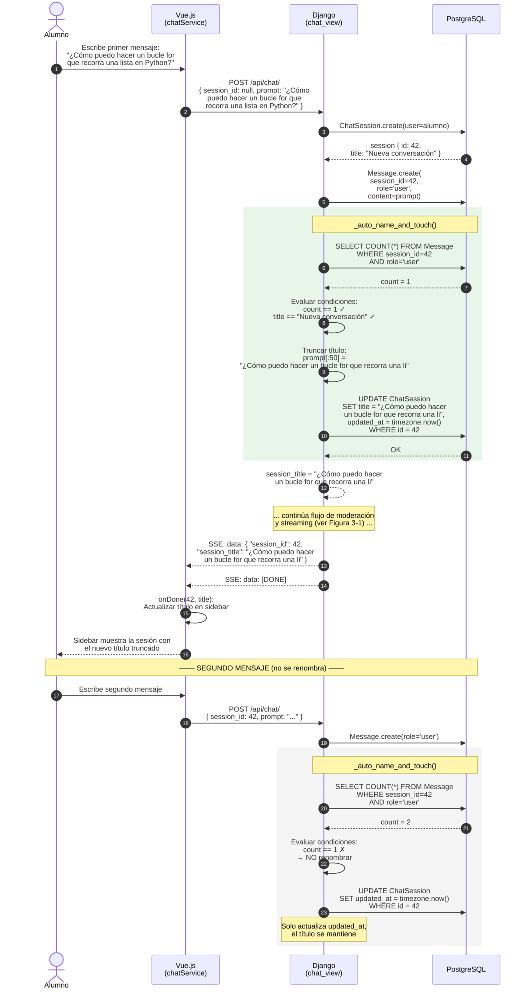

# Figura 3-3: Diagrama de Secuencia — Auto-Naming de Sesión (CU3)

Flujo del renombrado automático de sesión cuando el alumno envía el primer mensaje de chat.

```mermaid
sequenceDiagram
    autonumber
    actor Alumno
    participant Vue as Vue.js<br/>(chatService)
    participant Django as Django<br/>(chat_view)
    participant DB as PostgreSQL

    Alumno->>Vue: Escribe primer mensaje:<br/>"¿Cómo puedo hacer un bucle for<br/>que recorra una lista en Python?"
    Vue->>Django: POST /api/chat/<br/>{ session_id: null, prompt: "¿Cómo<br/>puedo hacer un bucle for que<br/>recorra una lista en Python?" }

    %% Crear sesión nueva
    Django->>DB: ChatSession.create(user=alumno)
    DB-->>Django: session { id: 42,<br/>title: "Nueva conversación" }

    %% Persistir mensaje del usuario
    Django->>DB: Message.create(<br/>session_id=42,<br/>role='user',<br/>content=prompt)

    %% Auto-naming
    rect rgb(232, 245, 233)
        Note over Django,DB: _auto_name_and_touch()
        Django->>DB: SELECT COUNT(*) FROM Message<br/>WHERE session_id=42<br/>AND role='user'
        DB-->>Django: count = 1

        Django->>Django: Evaluar condiciones:<br/>count == 1 ✓<br/>title == "Nueva conversación" ✓

        Django->>Django: Truncar título:<br/>prompt[:50] =<br/>"¿Cómo puedo hacer un bucle for que recorra una li"

        Django->>DB: UPDATE ChatSession<br/>SET title = "¿Cómo puedo hacer<br/>un bucle for que recorra una li",<br/>updated_at = timezone.now()<br/>WHERE id = 42
        DB-->>Django: OK
    end

    Django-->>Django: session_title = "¿Cómo puedo hacer<br/>un bucle for que recorra una li"

    Note over Django: ... continúa flujo de moderación<br/>y streaming (ver Figura 3-1) ...

    %% Al finalizar el stream
    Django-->>Vue: SSE: data: { "session_id": 42,<br/>"session_title": "¿Cómo puedo hacer<br/>un bucle for que recorra una li" }
    Django-->>Vue: SSE: data: [DONE]

    Vue->>Vue: onDone(42, title):<br/>Actualizar título en sidebar

    Vue-->>Alumno: Sidebar muestra la sesión con<br/>el nuevo título truncado

    %% Segundo mensaje: no se renombra
    Note over Alumno,DB: ─── SEGUNDO MENSAJE (no se renombra) ───

    Alumno->>Vue: Escribe segundo mensaje
    Vue->>Django: POST /api/chat/<br/>{ session_id: 42, prompt: "..." }
    Django->>DB: Message.create(role='user')

    rect rgb(245, 245, 245)
        Note over Django,DB: _auto_name_and_touch()
        Django->>DB: SELECT COUNT(*) FROM Message<br/>WHERE session_id=42<br/>AND role='user'
        DB-->>Django: count = 2

        Django->>Django: Evaluar condiciones:<br/>count == 1 ✗<br/>→ NO renombrar  

        Django->>DB: UPDATE ChatSession<br/>SET updated_at = timezone.now()<br/>WHERE id = 42
        Note over Django: Solo actualiza updated_at,<br/>el título se mantiene
    end
```
