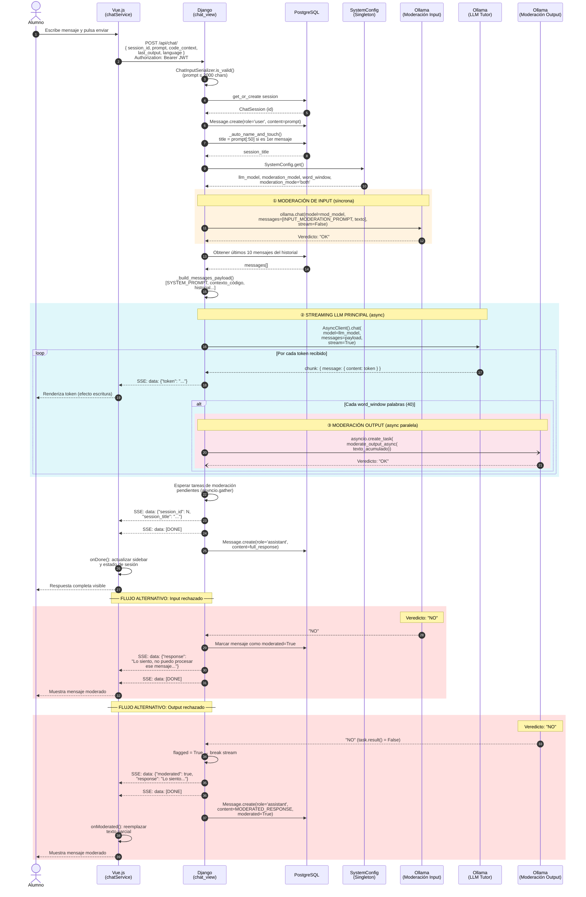

# Figura 3-1: Diagrama de Secuencia — Chat en Stream (CU1)

Flujo completo de una petición de chat con moderación de input y output habilitadas (`moderation_mode='both'`).

```mermaid
sequenceDiagram
    autonumber
    actor Alumno
    participant Vue as Vue.js<br/>(chatService)
    participant Django as Django<br/>(chat_view)
    participant DB as PostgreSQL
    participant Config as SystemConfig<br/>(Singleton)
    participant ModIn as Ollama<br/>(Moderación Input)
    participant LLM as Ollama<br/>(LLM Tutor)
    participant ModOut as Ollama<br/>(Moderación Output)

    Alumno->>Vue: Escribe mensaje y pulsa enviar
    Vue->>Django: POST /api/chat/<br/>{ session_id, prompt, code_context,<br/>last_output, language }<br/>Authorization: Bearer JWT

    %% Validación y persistencia
    Django->>Django: ChatInputSerializer.is_valid()<br/>(prompt ≤ 2000 chars)
    Django->>DB: get_or_create session
    DB-->>Django: ChatSession (id)
    Django->>DB: Message.create(role='user', content=prompt)
    Django->>DB: _auto_name_and_touch()<br/>title = prompt[:50] si es 1er mensaje
    DB-->>Django: session_title

    %% Lectura de configuración
    Django->>Config: SystemConfig.get()
    Config-->>Django: llm_model, moderation_model, word_window, <br/>moderation_mode='both'

    %% Moderación de input (síncrona)
    rect rgb(255, 243, 224)
        Note over Django,ModIn: ① MODERACIÓN DE INPUT (síncrona)
        Django->>ModIn: ollama.chat(model=mod_model,<br/>messages=[INPUT_MODERATION_PROMPT, texto],<br/>stream=False)
        ModIn-->>Django: Veredicto: "OK"
    end

    %% Construcción del payload
    Django->>DB: Obtener últimos 10 mensajes del historial
    DB-->>Django: messages[]
    Django->>Django: _build_messages_payload()<br/>[SYSTEM_PROMPT, contexto_código,<br/>historial...]

    %% Streaming del LLM
    rect rgb(224, 247, 250)
        Note over Django,LLM: ② STREAMING LLM PRINCIPAL (async)
        Django->>LLM: AsyncClient().chat(<br/>model=llm_model,<br/>messages=payload,<br/>stream=True)

        loop Por cada token recibido
            LLM-->>Django: chunk: { message: { content: token } }
            Django-->>Vue: SSE: data: {"token": "..."}
            Vue-->>Alumno: Renderiza token (efecto escritura)

            alt Cada word_window palabras (40)
                rect rgb(252, 228, 236)
                    Note over Django,ModOut: ③ MODERACIÓN OUTPUT (async paralela)
                    Django-)ModOut: asyncio.create_task(<br/>moderate_output_async(<br/>texto_acumulado))
                    ModOut--)Django: Veredicto: "OK"
                end
            end
        end
    end

    %% Finalización
    Django->>Django: Esperar tareas de moderación<br/>pendientes (asyncio.gather)
    Django-->>Vue: SSE: data: {"session_id": N,<br/>"session_title": "..."}
    Django-->>Vue: SSE: data: [DONE]
    Django->>DB: Message.create(role='assistant',<br/>content=full_response)

    Vue->>Vue: onDone(): actualizar sidebar<br/>y estado de sesión
    Vue-->>Alumno: Respuesta completa visible

    %% Flujo alternativo: input moderado
    Note over Django,Vue: ─── FLUJO ALTERNATIVO: Input rechazado ───

    rect rgb(255, 224, 224)
        Note over ModIn: Veredicto: "NO"
        ModIn-->>Django: "NO"
        Django->>DB: Marcar mensaje como moderated=True
        Django-->>Vue: SSE: data: {"response":<br/>"Lo siento, no puedo procesar<br/>ese mensaje..."}
        Django-->>Vue: SSE: data: [DONE]
        Vue-->>Alumno: Muestra mensaje moderado
    end

    %% Flujo alternativo: output moderado
    Note over Django,Vue: ─── FLUJO ALTERNATIVO: Output rechazado ───

    rect rgb(255, 224, 224)
        Note over ModOut: Veredicto: "NO"
        ModOut-->>Django: "NO" (task.result() = False)
        Django->>Django: flagged = True → break stream
        Django-->>Vue: SSE: data: {"moderated": true,<br/>"response": "Lo siento..."}
        Django-->>Vue: SSE: data: [DONE]
        Django->>DB: Message.create(role='assistant',<br/>content=MODERATED_RESPONSE,<br/>moderated=True)
        Vue->>Vue: onModerated(): reemplazar<br/>texto parcial
        Vue-->>Alumno: Muestra mensaje moderado
    end
```
