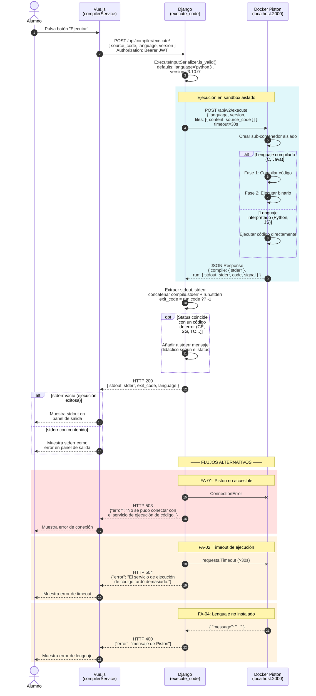

# Figura 3-2: Diagrama de Secuencia — Ejecución de Código en Piston (CU2)

Flujo completo de compilación y ejecución de código del alumno en el sandbox aislado.

```mermaid
sequenceDiagram
    autonumber
    actor Alumno
    participant Vue as Vue.js<br/>(compilerService)
    participant Django as Django<br/>(execute_code)
    participant Piston as Docker Piston<br/>(localhost:2000)

    Alumno->>Vue: Pulsa botón "Ejecutar"
    Vue->>Django: POST /api/compiler/execute/<br/>{ source_code, language, version }<br/>Authorization: Bearer JWT

    %% Validación
    Django->>Django: ExecuteInputSerializer.is_valid()<br/>defaults: language='python3',<br/>version='3.10.0'

    %% Llamada a Piston
    rect rgb(224, 247, 250)
        Note over Django,Piston: Ejecución en sandbox aislado
        Django->>Piston: POST /api/v2/execute<br/>{ language, version,<br/>files: [{ content: source_code }] }<br/>timeout=30s

        Piston->>Piston: Crear sub-contenedor aislado
        
        alt Lenguaje compilado (C, Java)
            Piston->>Piston: Fase 1: Compilar código
            Piston->>Piston: Fase 2: Ejecutar binario
        else Lenguaje interpretado (Python, JS)
            Piston->>Piston: Ejecutar código directamente
        end

        Piston-->>Django: JSON Response<br/>{ compile: { stderr },<br/>run: { stdout, stderr, code, signal } }
    end

    %% Procesamiento de respuesta
    Django->>Django: Extraer stdout, stderr<br/>concatenar compile.stderr + run.stderr<br/>exit_code = run.code ?? -1

    opt Status coincide con un código de error (CE, SG, TO...)
        Django->>Django: Añadir a stderr mensaje<br/>didáctico según el status
    end

    Django-->>Vue: HTTP 200<br/>{ stdout, stderr, exit_code, language }

    alt stderr vacío (ejecución exitosa)
        Vue-->>Alumno: Muestra stdout en<br/>panel de salida
    else stderr con contenido
        Vue-->>Alumno: Muestra stderr como<br/>error en panel de salida
    end

    %% Flujos alternativos
    Note over Django,Piston: ─── FLUJOS ALTERNATIVOS ───

    rect rgb(255, 224, 224)
        Note over Django,Piston: FA-01: Piston no accesible
        Django-xPiston: ConnectionError
        Django-->>Vue: HTTP 503<br/>{"error": "No se pudo conectar con<br/>el servicio de ejecución de código."}
        Vue-->>Alumno: Muestra error de conexión
    end

    rect rgb(255, 243, 224)
        Note over Django,Piston: FA-02: Timeout de ejecución
        Django-xPiston: requests.Timeout (>30s)
        Django-->>Vue: HTTP 504<br/>{"error": "El servicio de ejecución<br/>de código tardó demasiado."}
        Vue-->>Alumno: Muestra error de timeout
    end

    rect rgb(255, 243, 224)
        Note over Django,Piston: FA-04: Lenguaje no instalado
        Piston-->>Django: { "message": "..." }
        Django-->>Vue: HTTP 400<br/>{"error": "mensaje de Piston"}
        Vue-->>Alumno: Muestra error de lenguaje
    end
```
