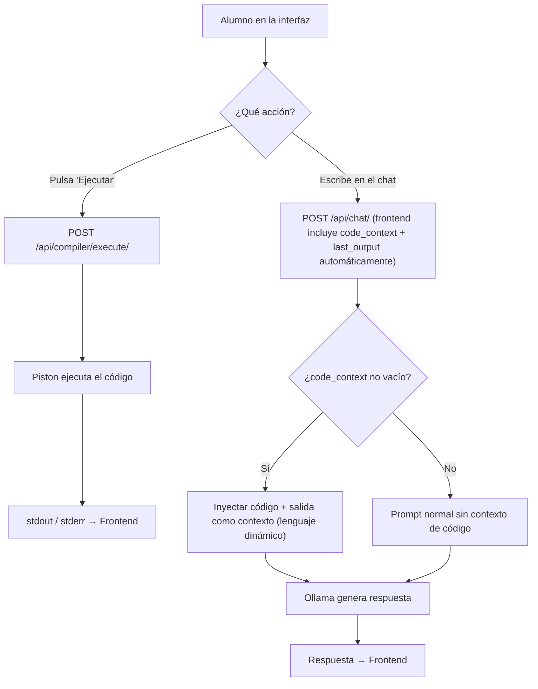

# Integración de Piston (Ejecución de Código) + Contexto de Código en el Chat

El alumno tiene dos zonas en la misma pantalla: el **editor de código** y el **chat con el tutor**. Los flujos son:

- **Ejecutar código** → va directo a Piston, sin pasar por Ollama.
- **Escribir en el chat** → el frontend envía **automáticamente** el contenido actual del editor y la última salida de ejecución como contexto adicional, sin que el alumno tenga que hacer nada. Ollama recibe todo junto.

---

## User Review Required

> [!IMPORTANT]
> El contenedor de Piston **no tiene puertos mapeados ni runtimes instalados**. Tras aplicar cambios:
> ```bash
> docker compose down && docker compose up -d
> docker exec tutor_compiler piston ppman install python
> ```

---

## Proposed Changes

### Infraestructura Docker

#### [MODIFY] [docker-compose.yml](file:///home/ignacio/Escritorio/SocratiCode/docker-compose.yml)

Añadir mapeo de puertos al servicio `compiler`:

```diff
   compiler:
     image: ghcr.io/engineer-man/piston
     container_name: tutor_compiler
+    ports:
+      - "2000:2000"
     tmpfs:
       - /tmp
```

---

### Configuración Django

#### [MODIFY] [settings.py](file:///home/ignacio/Escritorio/SocratiCode/src/config/settings.py)

1. Registrar `apps.compiler` en `INSTALLED_APPS`.
2. Añadir constante:
```python
PISTON_URL = "http://localhost:2000"
```

#### [MODIFY] [urls.py](file:///home/ignacio/Escritorio/SocratiCode/src/config/urls.py)

```python
path('api/compiler/', include('apps.compiler.urls')),
```

---

### Nueva App: `apps.compiler`

#### [NEW] [\_\_init\_\_.py](file:///home/ignacio/Escritorio/SocratiCode/src/apps/compiler/__init__.py)
Vacío.

#### [NEW] [apps.py](file:///home/ignacio/Escritorio/SocratiCode/src/apps/compiler/apps.py)
Configuración estándar de la app Django.

#### [NEW] [urls.py](file:///home/ignacio/Escritorio/SocratiCode/src/apps/compiler/urls.py)

| Método | Endpoint | Descripción |
|--------|----------|-------------|
| `POST` | `/api/compiler/execute/` | Ejecuta código vía Piston |

#### [NEW] [serializers.py](file:///home/ignacio/Escritorio/SocratiCode/src/apps/compiler/serializers.py)

- `ExecuteInputSerializer`: valida `source_code` (str, obligatorio), `language` (str, default `"python3"`) y [version](file:///home/ignacio/Escritorio/SocratiCode/.python-version) (str, default `"3.10.0"`). Ambos campos son necesarios porque Piston requiere lenguaje + versión o devuelve 400.
- `ExecuteOutputSerializer`: serializa `stdout`, `stderr`, `exit_code` y `language`.

#### [NEW] [views.py](file:///home/ignacio/Escritorio/SocratiCode/src/apps/compiler/views.py)

Vista `execute_code`:
1. Valida input con `ExecuteInputSerializer`.
2. `POST` a `{PISTON_URL}/api/v2/execute` con `language`, [version](file:///home/ignacio/Escritorio/SocratiCode/.python-version) y `source_code`.
3. Devuelve `stdout`, `stderr` y `exit_code`.
4. **No toca Ollama.**

#### [NEW] [tests.py](file:///home/ignacio/Escritorio/SocratiCode/src/apps/compiler/tests.py)

Tests unitarios con mock de Piston:
- Ejecución exitosa → `stdout` + `exit_code=0`
- Error de sintaxis → `stderr` + `exit_code≠0`
- Sin autenticación → 401
- `source_code` vacío → 400
- Piston caído → 503

---

### Modificación del Chat: Contexto Automático de Código

El frontend envía siempre `code_context`, `last_output` y `language` junto al mensaje del chat. El usuario no interviene — es transparente.

#### [MODIFY] [serializers.py](file:///home/ignacio/Escritorio/SocratiCode/src/apps/chat/serializers.py)

Añadir tres campos **opcionales** al [ChatInputSerializer](file:///home/ignacio/Escritorio/SocratiCode/src/apps/chat/serializers.py#5-15):

```python
code_context = serializers.CharField(required=False, allow_blank=True, default="")
last_output = serializers.CharField(required=False, allow_blank=True, default="")
language = serializers.CharField(required=False, allow_blank=True, default="python")
```

#### [MODIFY] [views.py](file:///home/ignacio/Escritorio/SocratiCode/src/apps/chat/views.py)

Inyección dinámica de contexto con el lenguaje correcto:

```python
code_context = serializer.validated_data.get('code_context', '')
last_output = serializer.validated_data.get('last_output', '')
language = serializer.validated_data.get('language', 'python')

if code_context:
    context_parts = [f"El alumno tiene este código en el editor:\n```{language}\n{code_context}\n```"]
    if last_output:
        context_parts.append(f"La última salida de ejecución fue:\n```\n{last_output}\n```")
    
    context_msg = "\n\n".join(context_parts)
    messages_payload.insert(1, {'role': 'system', 'content': context_msg})
```

El tag Markdown (`python`, `c`, `javascript`, etc.) se construye dinámicamente para que Ollama interprete el lenguaje correctamente.

---

## Resumen del Flujo



---

## Verification Plan

### Automated Tests

```bash
# Tests de la nueva app compiler (con mock de Piston)
uv run manage.py test apps.compiler -v2

# Tests existentes del chat (deben seguir pasando)
uv run manage.py test apps.chat -v2
```

### Test de integración manual

1. `docker compose down && docker compose up -d`
2. `docker exec tutor_compiler piston ppman install python`
3. Probar con `curl`:

```bash
# Ejecutar código
curl -s -X POST http://localhost:8000/api/compiler/execute/ \
  -H "Authorization: Bearer <token>" \
  -H "Content-Type: application/json" \
  -d '{"source_code": "print(\"hola mundo\")", "language": "python3", "version": "3.10.0"}'

# Chat con contexto automático de código
curl -s -X POST http://localhost:8000/api/chat/ \
  -H "Authorization: Bearer <token>" \
  -H "Content-Type: application/json" \
  -d '{
    "prompt": "este código no va",
    "code_context": "for i in range(10)\n  print(i)",
    "last_output": "SyntaxError: expected ':'",
    "language": "python"
  }'
```

4. Verificar en la terminal de Django que el log del LLM muestra el contexto inyectado con el lenguaje correcto.
